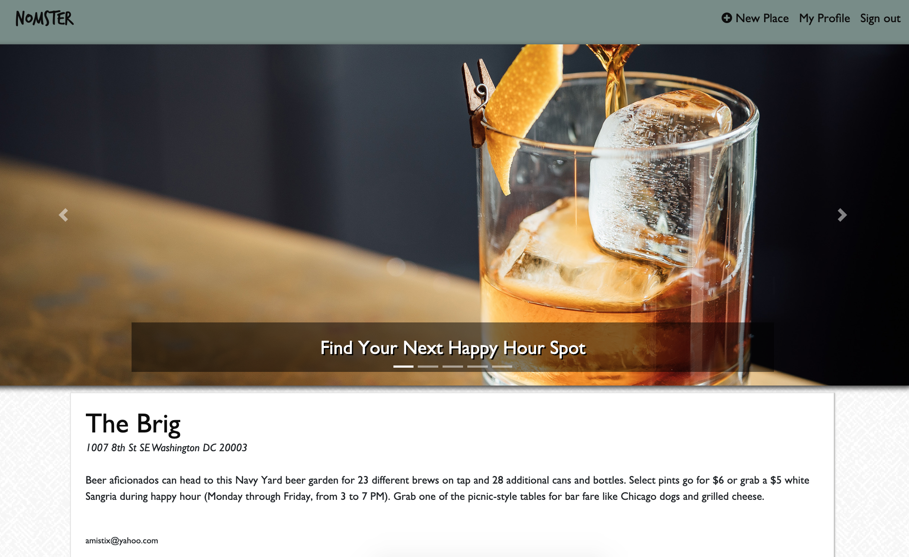
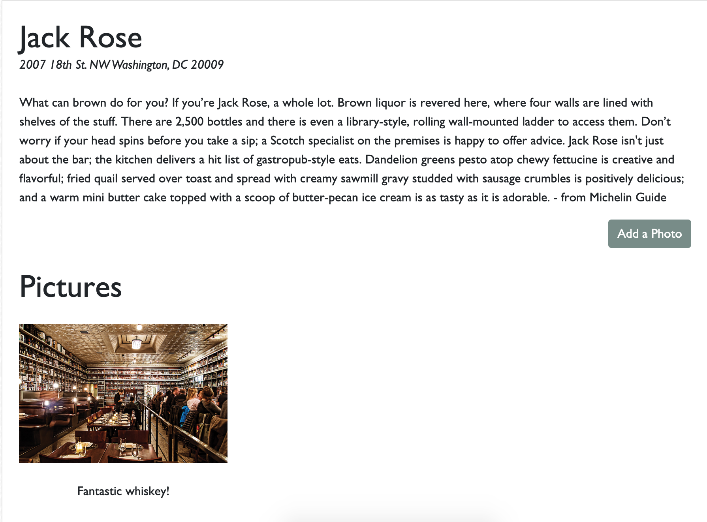
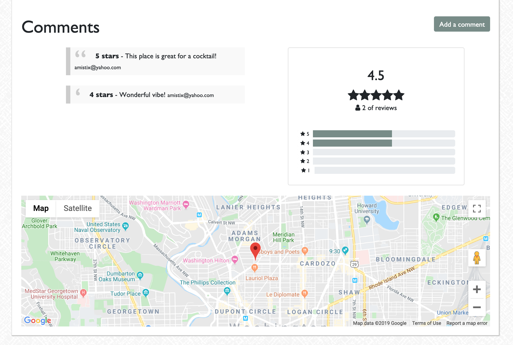
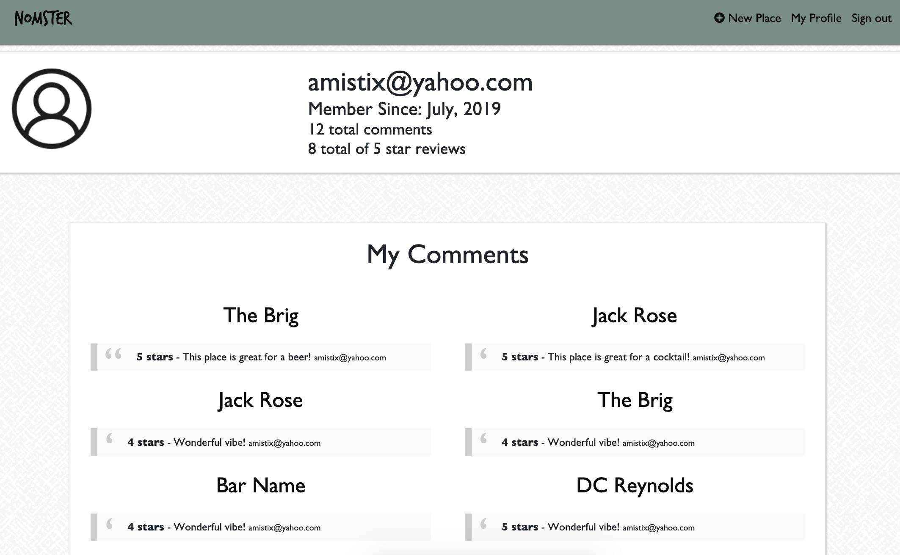
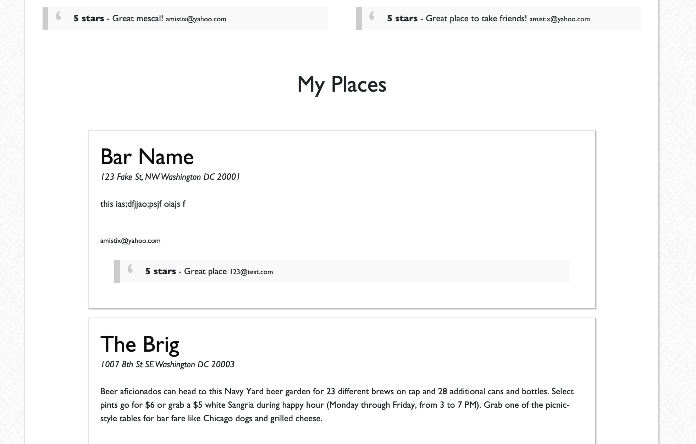

# README

Nomster is a Yelp Style App that was built with Ruby on Rails

You can see a live version here: https://nomster-alex-gergar.herokuapp.com/

This site allows users to add bars and resturants that have Happy Hours in Washington DC. Users can add photos, comments and reviews of the places. In addition they can see the profiles of other users to see what that user added or commented along with brief stats of the user.

This was created to be resourse to help young professionals in Washington DC find their next favorite Happy Hour spot.

See screenshots below.

